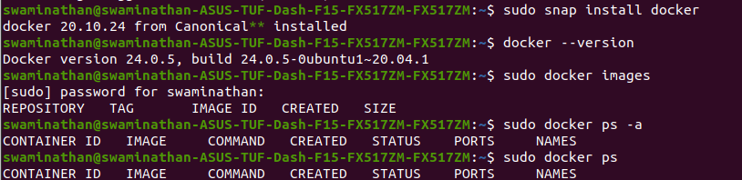

## Installing Docker:
Source: https://www.simplilearn.com/tutorials/docker-tutorial/how-to-install-docker-on-ubuntu

`sudo apt install docker.io`
`sudo snap install docker` - Installs Dependencies

Docker+ROS2 Review:
https://docs.google.com/presentation/d/1nzzvHQuBJAqdjlPDUl0l2_rU-MAu8jctu1Gt66vlHHM/edit#slide=id.g10838dd9226_0_25

## f1Tenth LAB 1:

**Running the container from the image (given repository):**
`$ docker run -it -v <absolute_path_to_this_repo>/lab1_ws/src/:/lab1_ws/src/ --name f1tenth_lab1 ros:foxy`

### ROS2:

#### Creating the Package:
These dependencies were added to the CMakelists.txt

Mirroring the same in package.xml too, we have:

**Due to facing several errors, the build type was later switched to ament_python**

Result after publishing the talker:
