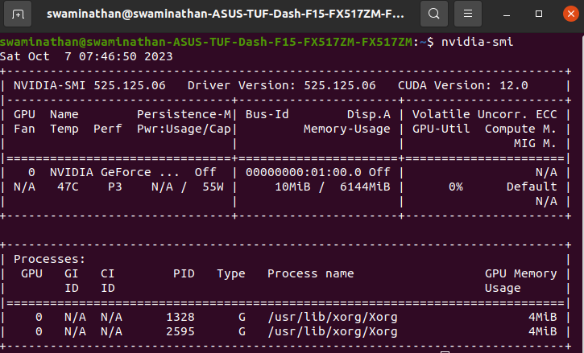
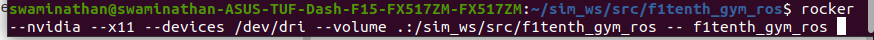
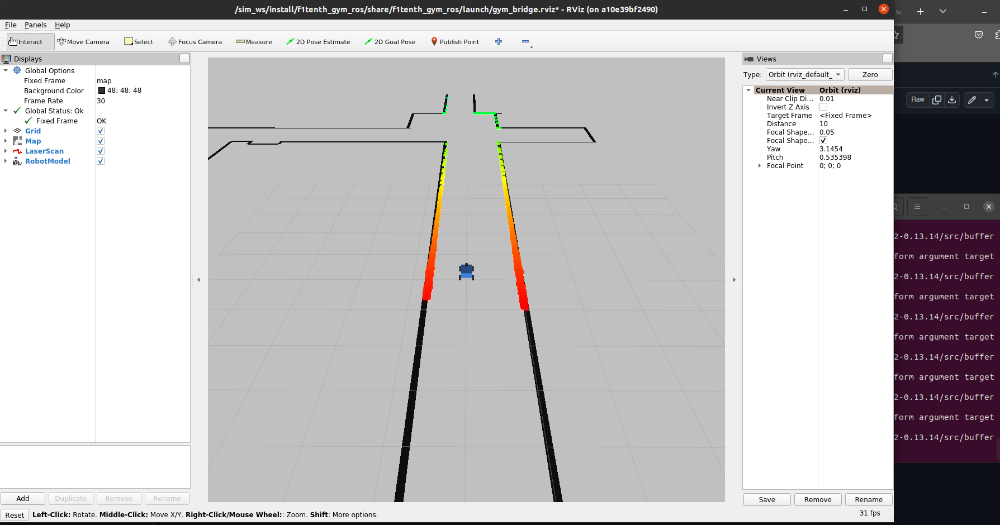
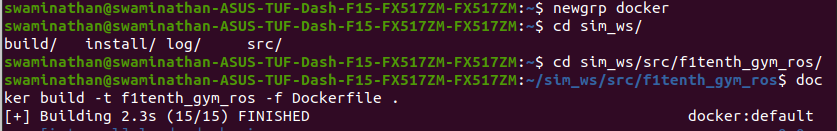
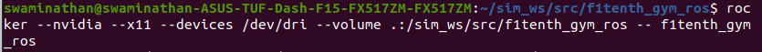
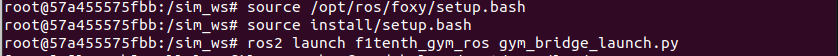
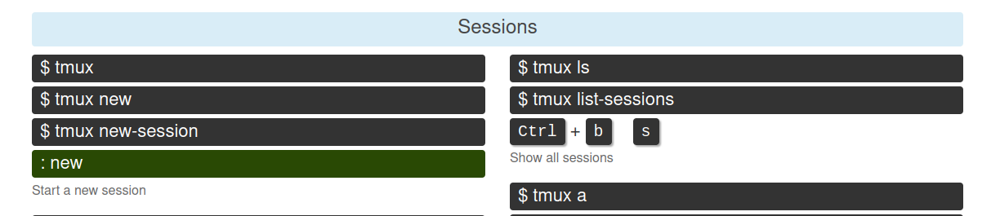
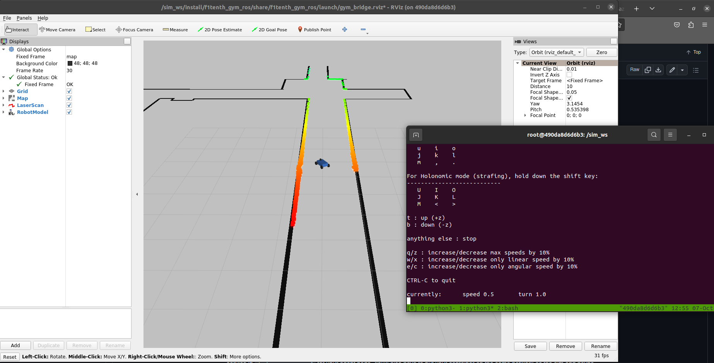
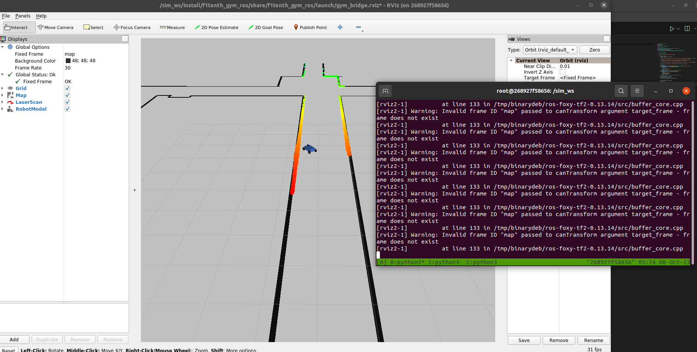
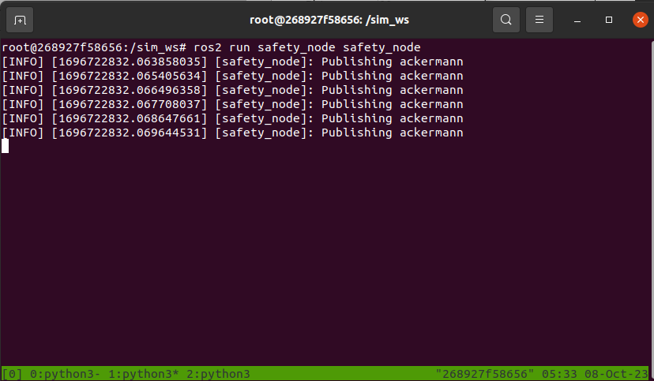

# F1Tenth Gym Simulation Setup
**Errors and Fixes:**
Sources:
https://github.com/f1tenth/f1tenth_gym_ros/blob/main/README.md
https://stackoverflow.com/questions/33562109/docker-command-cant-connect-to-docker-daemon
https://github.com/NVIDIA/nvidia-docker/issues/1746
https://forums.developer.nvidia.com/t/newly-installed-drivers-are-not-found-when-nvidia-smi-is-called/82686/5
https://docs.nvidia.com/datacenter/cloud-native/container-toolkit/latest/install-guide.html
https://docs.docker.com/engine/install/linux-postinstall/ 
https://askubuntu.com/questions/1129516/black-screen-at-boot-after-nvidia-driver-installation-on-ubuntu-18-04-2-lts (VERY HELPFUL)
http://tleyden.github.io/blog/2022/10/19/installing-autoware/ (VERY HELPFUL near the end of the documentation)

Made the Nvidia GPU get recognized and work!!

**Possible cause of error:** nvidia-cuda-toolkit was installed which corrupted the pre-installed nvidia-driver-525. **Aliter:** It could also be because of the docker and rocker user permissions. Refer to the documentation on docker to set it up so that `sudo` is not required anymore. 

Do the following if you encounter errors after the right steps in the github documentation in the right order.

**Note**: 
1. nvidia does not work with secure boot on. But installing the driver from Software & Updates or the .run file from the website auto-enables the secure boot. So have the secure boot disabled and then install nvidia driver in terminal.

2. Also note that disabling secure boot after installing nvidia when secure boot was enabled, causes a freeze in ubuntu during the boot. If this happens, go through the VERY HELPFUL link above, to fix it.

3. Install docker engine and not docker desktop. Also make sure to add the user to the docker group so that we don't have to use sudo before a docker command. (Also for rocker).

4. Many of the initial errors would be caused due to some ros2 packages not being installed. Install them with `$ sudo apt install ros-foxy-<pkg-name>`

5. If (2) is done, it would have ended up deleting the nvidia-container connection with docker. So follow the steps for nvidia-docker again.

6. Make sure to do the usermod code everytime you open the terminal.

**Error**: rviz2 error. To fix this, we use the following command while creating the container:


Observe that apart from copying the code in the github, we should also add `--devices /dev/dri` to the options. This is because NVidia driver has to be used for the rviz2 in this particular container (I believe* Point to verify and read more about).

**THE FINAL OUTPUT AFTER SETTING UP:**


**After making sure that all errors are fixed and dependencies are installed, this is how the simulator is set up each time:**





(There is a possibility that docker daemon might get shut down during sleep or restart of the laptop. There are many answers regarding the fixes for that on stackexchange. However, I did not face this error)

# Lab 2
Sources:
https://docs.ros.org/en/eloquent/Tutorials/Writing-A-Simple-Py-Publisher-And-Subscriber.html
https://github.com/gkouros/ackermann-drive-teleop/tree/master
https://github.com/f1tenth/f1tenth_gym_ros
http://docs.ros.org/en/noetic/api/sensor_msgs/html/msg/LaserScan.html
http://docs.ros.org/en/noetic/api/nav_msgs/html/msg/Odometry.html
http://docs.ros.org/en/jade/api/ackermann_msgs/html/msg/AckermannDrive.html

tmux sessions:


Moving with teleop_twist_keyboard


* While opening the code using vscode, make sure to source ros2 earlier.

The `safety_node.py` code:
````python 
#!/usr/bin/env python3
import rclpy
import math
from rclpy.node import Node

import numpy as np
from sensor_msgs.msg import LaserScan
from nav_msgs.msg import Odometry
from ackermann_msgs.msg import AckermannDriveStamped, AckermannDrive


class SafetyNode(Node):
    """
    The class that handles emergency braking.
    """
    def __init__(self):
        super().__init__('safety_node')
        """
        One publisher should publish to the /drive topic with a AckermannDriveStamped drive message.

        You should also subscribe to the /scan topic to get the LaserScan messages and
        the /ego_racecar/odom topic to get the current speed of the vehicle.

        The subscribers should use the provided odom_callback and scan_callback as callback methods

        NOTE that the x component of the linear velocity in odom is the speed
        """
        self.speed = 0.
        self.publisher1 = self.create_publisher(AckermannDriveStamped, 'drive', 10)
        self.subscription1 = self.create_subscription(
            LaserScan,
            '/scan',
            self.scan_callback,
            10)
        self.subscription1  # prevent unused variable warning
        self.subscription2 = self.create_subscription(
            Odometry,
            '/ego_racecar/odom',
            self.odom_callback,
            10)
        self.subscription2  # prevent unused variable warning

    def odom_callback(self, odom_msg):
        # update current speed
        self.speed = odom_msg.twist.twist.linear.x


    def scan_callback(self, scan_msg):
        minTTC = -1   
        # calculate TTC
        for i in scan_msg.ranges:
            if type(i) == float:
                _rate = (self.speed * (math.cos(scan_msg.angle_increment*i + (scan_msg.angle_min + scan_msg.angle_max)/2)))

                if _rate <= 0:
                    _rate = 0.0000001

                TTC = i/_rate
                if minTTC == -1:
                    minTTC = TTC
                elif TTC < minTTC:
                    minTTC = TTC
        
        # publish command to brake
        if minTTC < 1:
            self.get_logger().info('Publishing ackermann')
            ackermann_cmd_msg = AckermannDriveStamped()
            ackermann_cmd_msg.drive.speed = 0.
            ackermann_cmd_msg.drive.steering_angle = 0.
            self.publisher1.publish(ackermann_cmd_msg)
        pass

def main(args=None):
    rclpy.init(args=args)
    safety_node = SafetyNode()
    rclpy.spin(safety_node)

    # Destroy the node explicitly
    # (optional - otherwise it will be done automatically
    # when the garbage collector destroys the node object)
    safety_node.destroy_node()
    rclpy.shutdown()


if __name__ == '__main__':
    main()
````

**Some important pointers:**
* The publisher does not need to be followed by a timer with timer_callback function. That was called in the example only because it was needed to print the string msg every interval.
* The publish() function should be called in one of the callbacks.
* Note that the speed of the car is from twist.twist.linear.x of the odometry message.
* We used AckermannDriveStamped here. Refer to this same code when in doubt about the syntaxes.
* I have added the dependencies in package.xml to `<exec_depend></exec_depend>` tag.
 
**Errors and Fixes:**
* Starting the rocker image again requires us to use --devices /dev/dri. 
* This time, instead of creating two volumes as suggested by the online repo, I created one volume mounting the entire workspace on to the container. I did this because whatever external changes were already made to the safety_node package did not reflect in the container. (To check why this happened, later).
* The safety_node.py file has to be added to the safety_node directory in the package (along with \_\_init\_\_.py). Only doing this makes sure that the node can be run with ros2 run.
* By going through the f1tenth_gym_ros package, it was found out that a resource/ directory with just a file with the same name as the package, has to be added to the package directory, before building.

## Some tips on using tmux:
`tmux` - starts the tmux terminal
`ctrl+B and then C` - creates a new tmux window
`ctrl+B and then N` - next window
`ctrl+B and then P` - previous window

**Commands in different tmux terminals:**
`ros2 launch f1tenth_gym_ros gym_bridge_launch.py`
`ros2 run teleop_twist_keyboard teleop_twist_keyboard`
`ros2 run safety_node safety_node`

## Final Output:
The TTC threshold was given to be 1. The car succesfully stops before hitting the wall.
Some improvements to be made: To tweak the TTC better, and to increase the angle_max and angle_min, so that reverse collisions don't happen.

