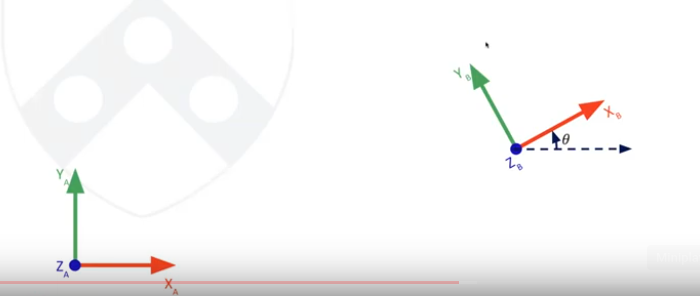

**Global Map** - Ties submaps together.
### Coordinate frame:
A set of orthogonal axes attached to a body that serves to describe pos of points relative to that body.

map frame - wrt map
sensor frame - wrt sensor

stattc transform - rigid body
dynamic transform - example: map and car.

odom - Not exactly a frame. Describes the history between two frames: base_link and map. 
Odometry_message provides pose estimation and pose is relative to the odom frame.

**An example:**
In TTC only one value of threshold is defined. But depending on what frame we choose on the car, the distance between the car and wall differs with direction.
Thus best way to overcome this is to use the centre of the car as the frame.

Note that LIDAR is at the front of the car. How do we transform measurements from LIDAR to the newer frame?

Note that we are calcuating the point B with respect to the frame A. Now, in case of translation:

Now, putting it together:

