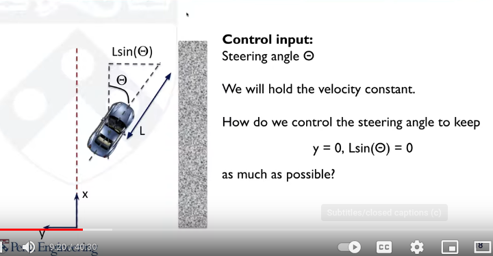
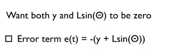
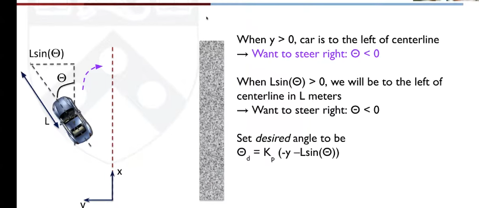
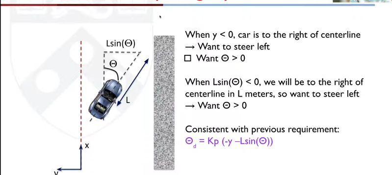
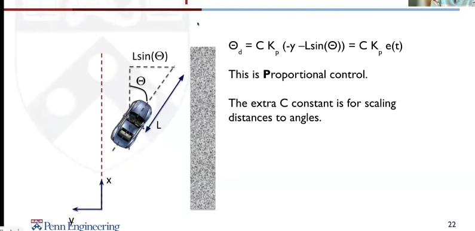
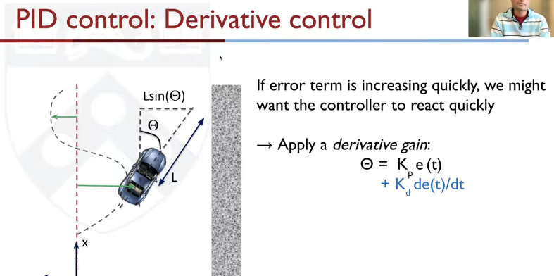
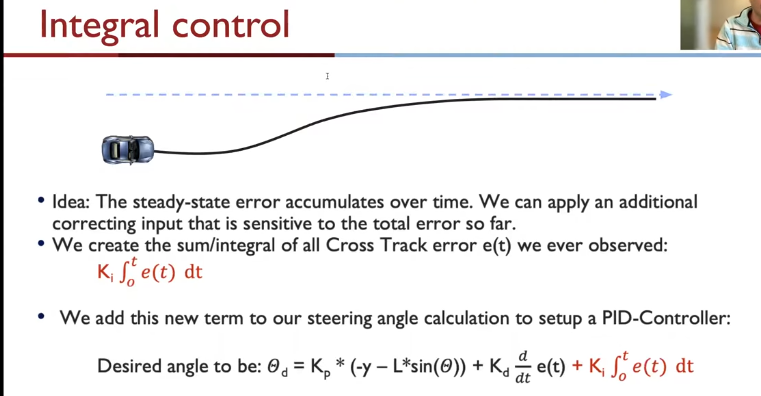
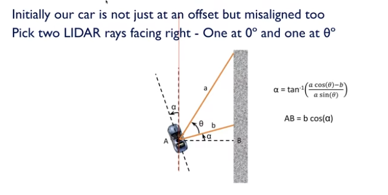
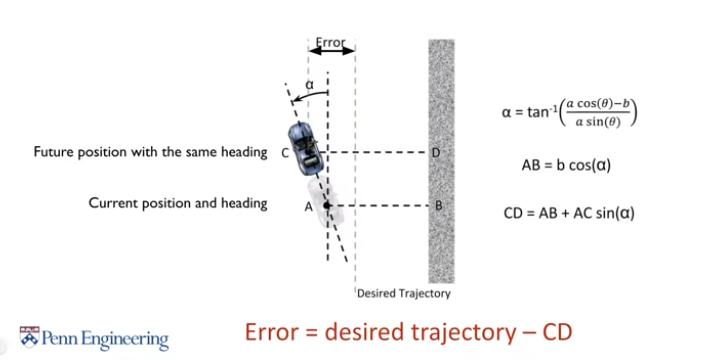

## The wall following problem
**Two objectives:**
* Parallel to the walls
* roughly move along the centre line

**Control objective:**
1) y = 0
2) Lsin(theta) = 0

Note that we will keep L constant here. (It is a parameter). Reducing the L makes it jerkier. and Increasing it makes the converging rate small.

Since y and theta are opposite. The error at any time will be

  

The problem of overshooting can be fixed by either making the integral term work only after the error has come into a small margin, or by bounding the integral error accumulation.

We cannot immediately consider this for the error. Since, by the time we calculate AB, we might have gone further on the track.
