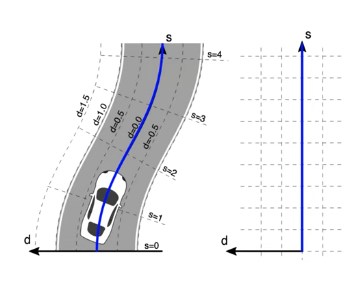
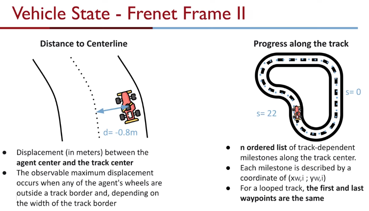
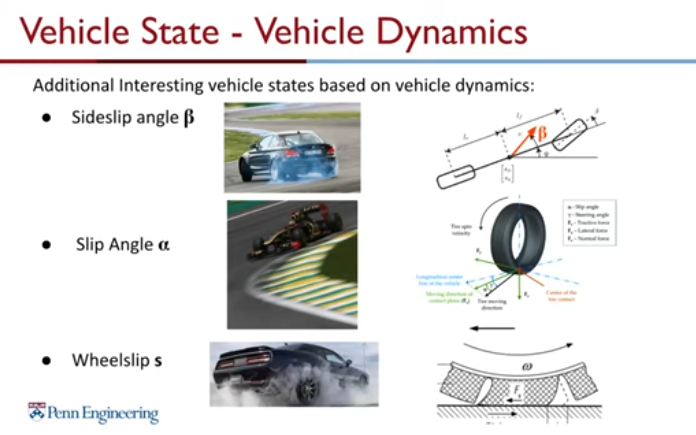
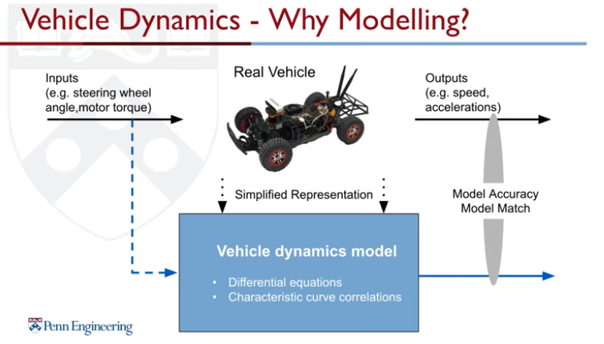
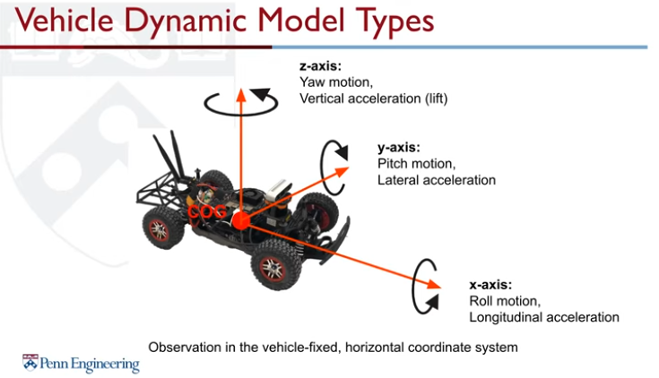
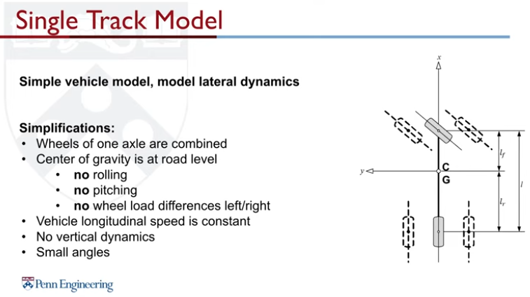
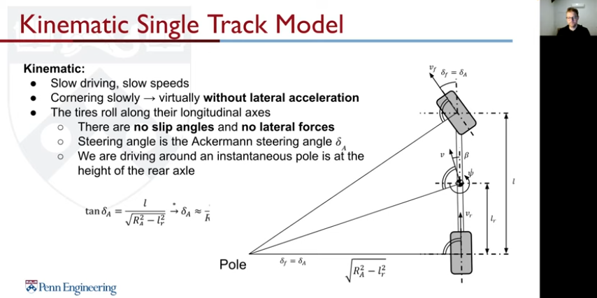
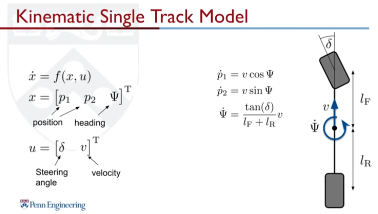
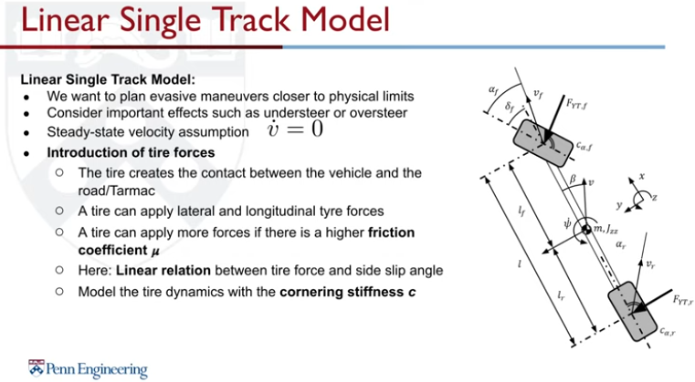
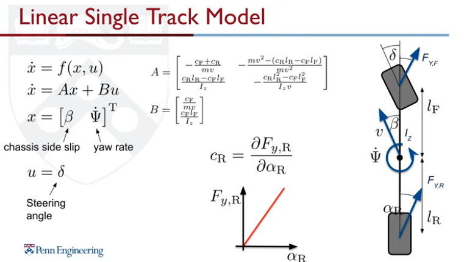

## Vehicle States
1. Position: Only translation, w.r.t to the coordinate system and the position is the COG of the vehicle.
2. Heading: Angle that displays the direction that the vehicle looks at.
3. Frenet Frame: continuous, differentiable curve in 3d euclidean space. Coordinate system spanned by a **tangential vector t** and **normal vector n**  at any point of the reference line. **s coordinate** is the run length and **d coordinate** is the lateral position relative to the reference path. d is positive to the left of the reference path.

4. Velocity: The observed speed. Sensor: Pivot sensor.
5. Acceleration: observed acceleration when vehicle changes its state. Measured with IMU sensors.
6. Steering Angle: Angle that displays the direction in which the front wheels currently "looks at"

* * *
### Kinematic Single Track Model - Bicycle Model

* * *
### Linear Single Track Model
1. Plan evasive maneuvers closer to physical limits
2. Consider important effects such as understeer or oversteer
3. Steady-state velocity assumption, rate of change of speed = 0

