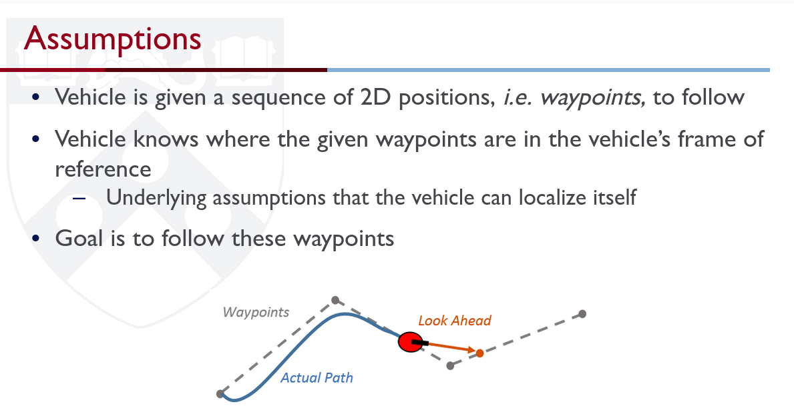
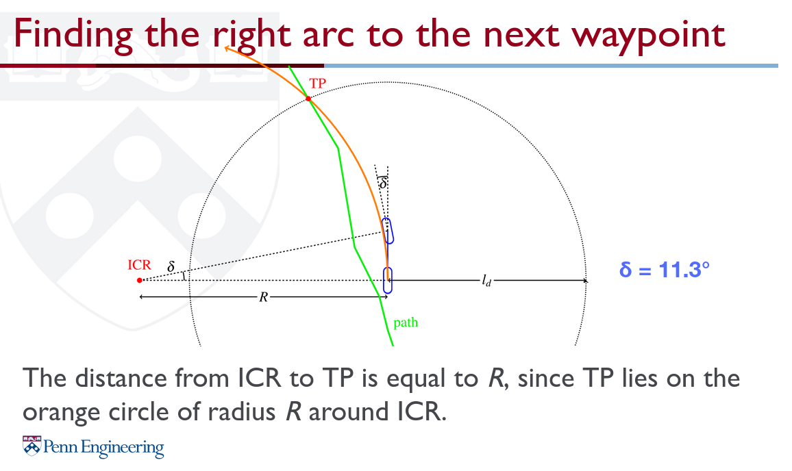
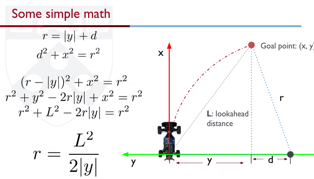
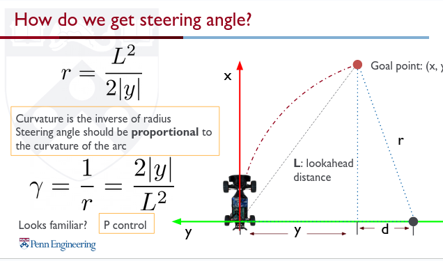
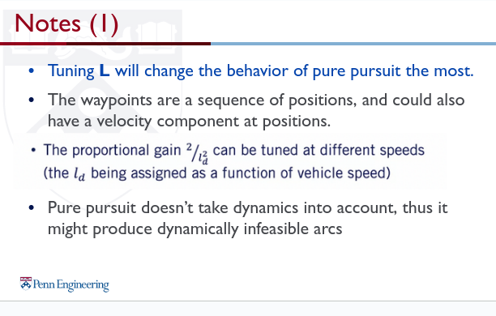
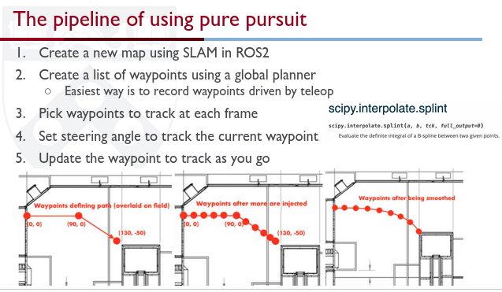

Here, observe that we are using the **Bicyle model** for the vehicle. ICR is the instantaneous centre of rotation. And it lies on the y axis in the frame of the vehicle.

Note that Pure pursuit doesnt take vehicle dynamics into account. So dynamically infeasible arcs might also be considered. Also, the vehicle might crash into obstacles.

