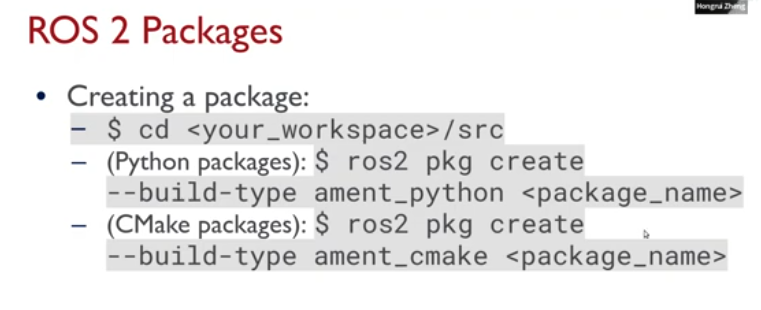

# F1Tenth Tutorial 1
## Docker CLI commands
`$ docker pull [options] name[tags:@digest]`
Pull an image or repository.

`$ docker run [options] image [command] [arg...]`
Creates a writeable container layer over the specified image and then starts it using the specified command.

`$ docker build [options] path | URL |`
Build an image from a Dockerfile. Context is the set of files located in the specified PATH or URL.

`$ docker ps [OPTIONS]`
List containers

**Noteable options:**
`-a`: Show all containers, running and stopped.
`-s`: Display total file size.

`$ docker images [options] [repository[:tag]]`
List images

`$ docker rm [options] container`
Remove container

`$ docker rmi [options] image`
Remove image
 
`$ docker exec [options] container command [arg..]`
Run a command in an already running container.

`$ docker cp [options] CONTAINER:SRC_PATH DEST_PATH`
Copy files between a container and the local filesystem.

## Dockerfile Syntax
 `# Comment`
 `INSTRUCTION arguments`
 
 **Types of instructions:**
 Dockerfile must beign with a `FROM` instruction. Examples `FROM 	ros_distro` .
 
 `RUN <command>`
 
 `CMD <command> param1 param2`
 Only one CMD instruction in a Dockerfile. Only the last one will take effect. The main purpose of CMD is to provide defaults for an executing container.
 
 `ENV <key>=<value>`
 Sets the environment variable `<key>` to the value `<value>`. This persists when a container is run from resulting image.
 
 `COPY [--chown=<user>:<group>] <src> .... <dest>`
 
 `ENTRYPOINT ["Executable", "param1", "param2"]`
 Configure a container that will run as an executable.
 
 ## Bind mounts and Volumes
Bind mount mounts a file or dir on the host machine into a container. The file or directory is referenced by its absolute path on the host machine.

Volume creates a new dir within docker's storage directory on the host machine and Docker manages that directory's contents.

**STARTING A CONTAINER WITH A BIND MOUNT**
**Two ways:**
`--mount` or `-v`  when calling `docker run`.

### Docker network
Users can create a docker network to connect containers to them or connect containers to non-Docker workloads.

`$ docker network create <name>` to create user-defined bridge network.

`$ docker network connect <net-name> <container>` to connect a container to a network.

Use the `--network host` option when using docker run to share the host's network with container.

**Docker Compose**
Compose --> define and run multiple container at the same time. A yaml file `docker-compose.yml` is used to configure. Run `docker compose up` to start all your containers.

# ROS2
ROS2 has tighter python integration. launch file is in python.

**Parameters**
`self.declare_parameter('my_param')`
`self.get_parameter('my_param')`

**Build tool for ROS2**
Build the workspace with `colcon`:
-- From the root of your workspace `$ colcon build`
-- Useful arguments when building:
- `--packages-up-to` builds the package you want, plus all its dependencies but not whole workspace.
- `--symlink-install` saves you from having to rebuild every time you tweak python scripts.
- `--event-handlers console_direct+`

**Sourcing:**

Can create packages using CMake or python.
**CMake packages:**
package.xml, CMakeLists.txt

**Python packages:**
package.xml, setup.py, setup.cfg, /<package_name> (this directory contains the \_ \_init\_ \_.py  file)

